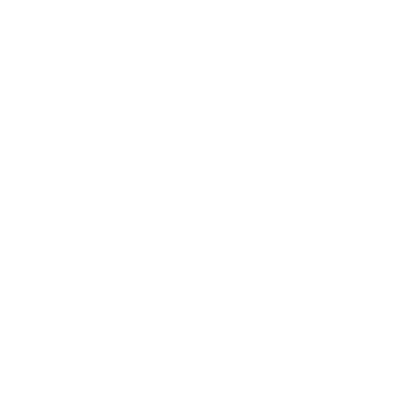

---
**Lemon** is a tart, versatile citrus fruit believed to have originated in the tropical region of northeast India and western China! But is also a **Enterprise** made for being ***ULTIMATE***

## Projects
* [**Lime Engine**](#lime-engine): A game engine made in web but is possible to export to Google Play Store (if is Android or VR/XR), App Store (if is iOS) and Desktop (if is Windows, Mac or Linux)

<h2 id="lime-engine">Lime Engine</h2>

The ultimate **web-like Game Engine** made for 2D/3D games. The engine is similar to Construct 3 and GDevelop 5 but is free!

### Features:
* No-code (but in 1.7, the engine will add 2 language support as script languages: L Programming Language and Rust for code, in addition of No-code)
* Easy-to-use
* Simple Sprite Editor and Audio Editor
* Simple 3D Model Editor

#### But wait! There is ONE THING:
In 2.0, the engine will be avaliable to download for Desktop but actully, in this version, 0.9, in addition to web, it can be downloaded for Android

<!--

**Here are some ideas to get you started:**

🙋‍♀️ A short introduction - what is your organization all about?
🌈 Contribution guidelines - how can the community get involved?
👩‍💻 Useful resources - where can the community find your docs? Is there anything else the community should know?
🍿 Fun facts - what does your team eat for breakfast?
🧙 Remember, you can do mighty things with the power of [Markdown](https://docs.github.com/github/writing-on-github/getting-started-with-writing-and-formatting-on-github/basic-writing-and-formatting-syntax)
-->
